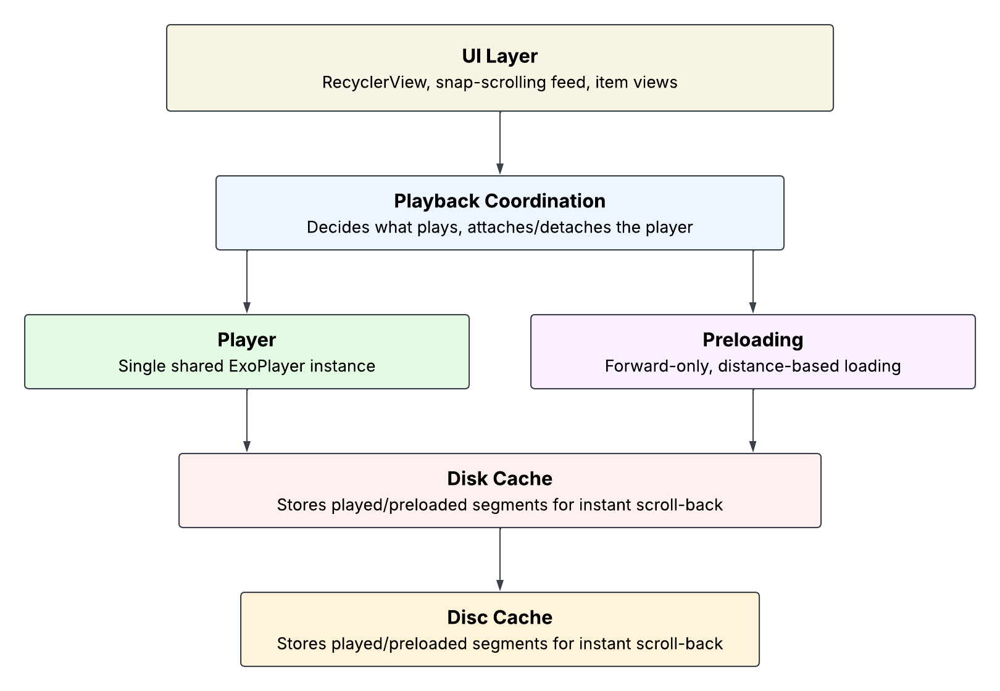

# ReelsApp — Android Reels/Short-Video Architecture

A focused, open-source demo of the architecture behind a TikTok/Instagram-Reels-style
vertical feed on Android — single shared player, scroll-snap playback switching,
distance-based preloading, and disk caching for instant scroll-back.

This isn't a tutorial app. It's a stripped-down version of patterns I've used in
production reels/short-video features, rebuilt from scratch to be readable end to end.


---

## What this demonstrates

- A single `ExoPlayer` instance shared across the whole feed, attached and detached
  between RecyclerView item views as the user scrolls — not a player per item.
- Scroll-snap-driven playback: the player switches to whichever item the user has
  settled on, not whichever item happens to be visible mid-scroll.
- Distance-based preloading via Media3's `DefaultPreloadManager`, so the next item
  starts playing with little to no buffering delay.
- Disk caching via `CacheDataSource` + `SimpleCache`, so scrolling back to an
  already-watched reel is instant.
- A clean, layered project structure with each class doing one job.

---

## Architecture overview



At a high level:

```
MainActivity
  ├─ initReelsUi()       → RecyclerView + PagerSnapHelper + Adapter
  ├─ initMedia()         → CacheManagerReels + MediaSetupFactory → PreloadManager + Player
  └─ setupScrollController() → ReelsScrollController owns playback + scroll/recycle lifecycle
```

`ReelsScrollController` is the single source of truth for "what's currently playing
and where" — both the adapter (for click-to-pause) and the player listener (for
first-frame UI updates) read from it rather than each other.

---

## Key decisions

### Single player, not one per item

Per-item players are the obvious first approach, but they don't scale — each one
allocates its own decoder and surface, which gets expensive fast in a vertically
scrolling feed. One player, swapped between item views via
`PlayerView.switchTargetView()` on scroll-snap, keeps memory and decoder usage
bounded regardless of list length.

### Forward-only preloading, reactive caching for scroll-back

`DefaultPreloadManager` only ever looks **forward** from the current position —
see `ReelsPreloadManager.getPreloadStatus()`. Scrolling **back** to an
already-watched reel is handled separately, by `CacheDataSource` writing to disk
as a side effect of normal playback. This keeps the preload manager's job
simple and forward-focused, and reuses content you've already streamed instead
of preloading it twice.

### Static list, no sliding window

This demo registers all reels with the preload manager once at startup and never
removes them — fine for a small, fixed list, since `getPreloadStatus()` already
limits *how much* of each item gets loaded based on distance from the current
position. In a production infinite feed (backed by `PagingDataAdapter`), items
have to be explicitly added and removed from the preload manager as they enter
and exit a sliding window — without that, registered preload sources accumulate
indefinitely and the app eventually hits an `OutOfMemoryError`. That pattern is
covered in the [blog post](#links) rather than this repo, since it only makes
sense in the context of pagination.

### What's deliberately left out

To keep the architecture readable, this demo skips:

- Mute toggle, seek bar, custom buffering UI — standard player chrome, not
  specific to reels architecture.
- First-frame thumbnails — the player starts fast enough via preloading that a
  placeholder thumbnail adds little here.
- `PreCacheHelper` (Media3 1.9.0+) — lets you warm the disk cache ahead of the
  preload manager's own window. Worth knowing about, not load-bearing for this
  demo's scope.
- Sliding window preload registration — see above.

Each of these is a reasonable next step in a real app, not an oversight here.

---

## Sample video encoding

The 10 sample reels are hosted on Mux and encoded with a consistent profile, so
preload and cache timing are comparable across all of them:

- Video bitrate: 1200 kbps
- Codec: H.264 / AAC audio
- Format: HLS (`.m3u8` / `.ts` segments)

```bash
# Illustrative — actual values may vary slightly per source clip
ffmpeg -i input.mp4 -c:v libx264 -b:v 1200k -c:a aac -b:a 128k \
  -hls_time 6 -hls_playlist_type vod output.m3u8
```

In production, encoding follows a standardized profile per delivery target
(resolution ladder, adaptive bitrate, device-specific tuning) — that pipeline is
outside this demo's scope, which focuses on the player/preload/cache layer once
a standard HLS stream is already available.

---

## Project structure

```
data/
  LocalReelsDataSource.kt   — static sample reel list
  ReelsRepository.kt        — thin pass-through to the data source

model/
  Reel.kt                   — id, hlsUrl, title

player/
  ReelsPlayerManager.kt     — shared ExoPlayer instance
  ReelsPreloadManager.kt    — distance-based preload status control
  PreloadConfig.kt          — preload window configuration
  MediaSetupFactory.kt      — builds PreloadManager, LoadControl, TrackSelector

cache/
  CacheManagerReels.kt      — SimpleCache + CacheDataSource setup
  ReelsConfig.kt            — cache size, timeouts, user agent

presentation/
  ReelsViewModel.kt

ui/
  MainActivity.kt
  ReelsAdapter.kt
  ReelsViewHolder.kt
  ReelsScrollController.kt  — owns playback state + scroll/recycle lifecycle
```

---

## Tech stack

- Kotlin
- AndroidX Media3 1.8.0 (ExoPlayer, HLS, preload manager)
- RecyclerView + `PagerSnapHelper`
- ViewBinding

---

## Running this project

1. Clone the repo and open in Android Studio.
2. Run on a device or emulator — sample videos are hosted on Mux and load
   directly, no setup required.
3. To use your own videos, replace the URLs in `LocalReelsDataSource.kt` with
   any HLS (`.m3u8`) stream — Cloudflare Stream, Mux, or your own hosting all
   work, since the player layer doesn't care about origin.

---

## Links

- Blog: full architecture write-up, decisions, and the production sliding-window
  pattern — [placeholder]
- LinkedIn: [placeholder]
- Portfolio: usmanali.dev

---

## License

MIT — use this freely to learn from, fork, or adapt.
